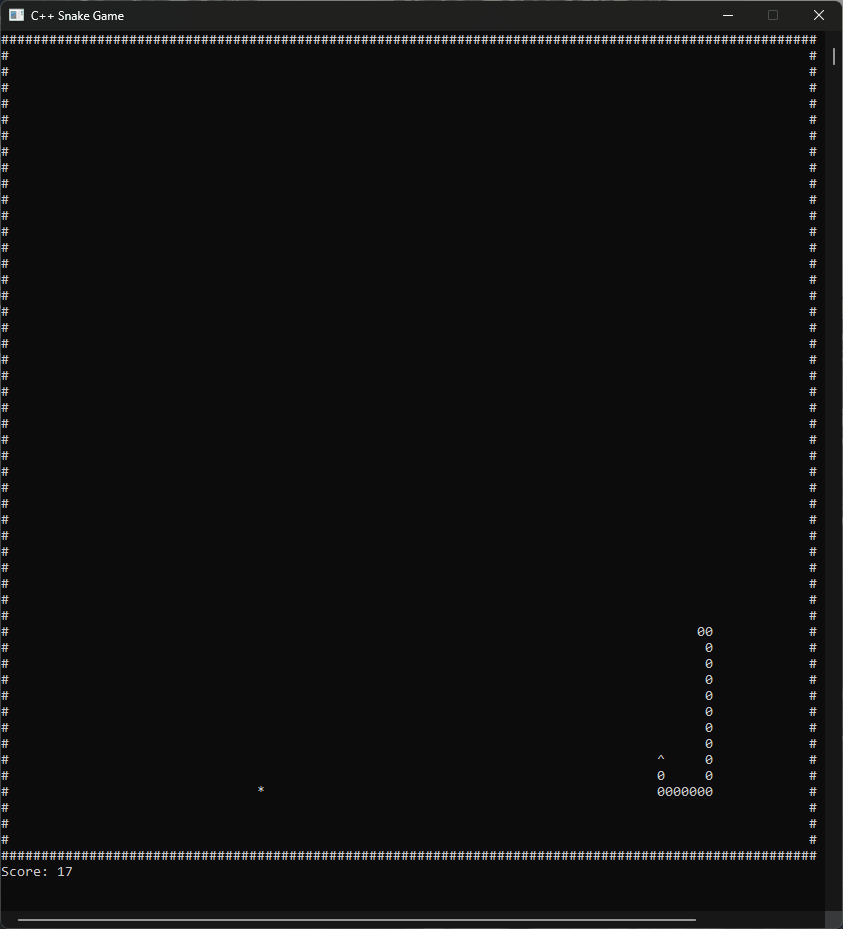

# C++ Snake Game

A simple snake game written in C++ for Windows terminal.



## Requirements

- Windows OS
- CMake (3.10+)
- C++ compiler (Visual Studio, MinGW, etc.)

## Build Instructions

1. **Clone and navigate to project:**
```bash
git clone https://github.com/xelfiera-shn/cpp-snake-game.git
cd cpp-snake-game
```

2. **Build with CMake:**

Install CMake from [cmake.org](https://cmake.org/download/) and add to PATH.

```bash
mkdir build
cd build
cmake ..
cmake --build .
```

## How to Run

⚠️ **Important: Must run as Administrator**

The game requires administrator privileges to work properly.

**File Explorer:**
1. Go to `build/Debug` folder
2. Right-click `CppSnakeGame.exe`
3. Select "Run as administrator"

## Controls

- **W** - Move up
- **A** - Move left
- **S** - Move down
- **D** - Move right

## Troubleshooting

**Game won't start:** Make sure you're running as administrator.

**Build errors:** Check that all source files exist and you have a C++ compiler installed.

---
